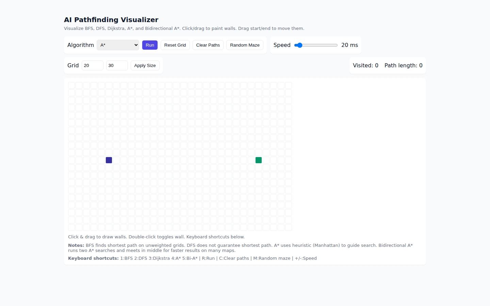
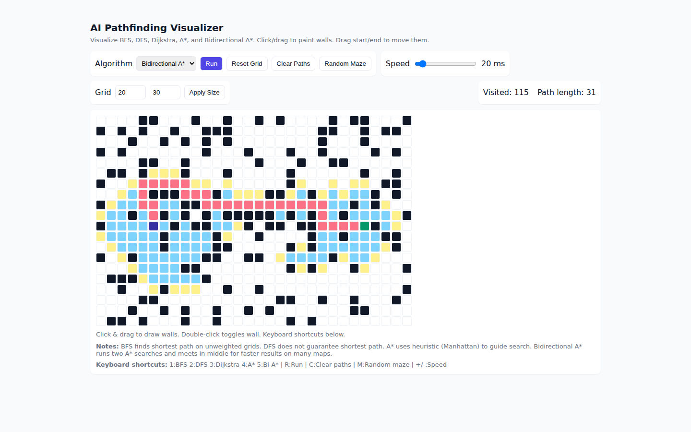

# AI Pathfinding Visualizer (Plain HTML / CSS / JS)

This project is a single-page web application that visualizes pathfinding algorithms on a grid.

## Features
- Algorithms: BFS, DFS, Dijkstra, A*, **Bidirectional A*** (added)
- Click & drag to place walls. Double-click toggles wall.
- Drag start/end points by clicking and dragging them.
- Random maze generator.
- Speed control and grid size control.
- Keyboard shortcuts:
  - `1` BFS, `2` DFS, `3` Dijkstra, `4` A*, `5` Bi-A*
  - `R` Run, `C` Clear paths, `M` Random maze
  - `+` / `-` change speed

## Files
- `index.html` — HTML file (UI skeleton)
- `styles.css` — CSS styles
- `app.js` — JavaScript (grid, algorithms, visualization)
- `README.md` — this file
- `FINAL_REPORT.md` — final report for submission

## How to run
1. Download the files and unzip (if zipped).
2. Open `index.html` in your browser (Chrome / Edge / Firefox).
3. Use the controls to set up grid, algorithm and press Run.

No build steps or server required.

## Screenshots

### Initial Grid View

### Running Pathfinding (Bidirectional A*)

### Demo Video
<video controls width="100%" preload="metadata">
  <source src="screenshots/Demo.mp4" type="video/mp4">
  Your browser does not support the video tag.
</video>

If the video does not appear on GitHub, use this direct link: [Demo.mp4](screenshots/Demo.mp4)

## Notes & Improvements
- Bidirectional A* implementation included is a basic version suitable for grid maps. For production-grade usage, consider optimizing with better heuristics, tie-breaking, and faster data structures.
- You can add weighted cells by modifying `node.weight` directly in the grid (not included in UI yet).
- Performance: large grids with slow devices may be slower; consider using requestAnimationFrame batching for high-performance animations.
